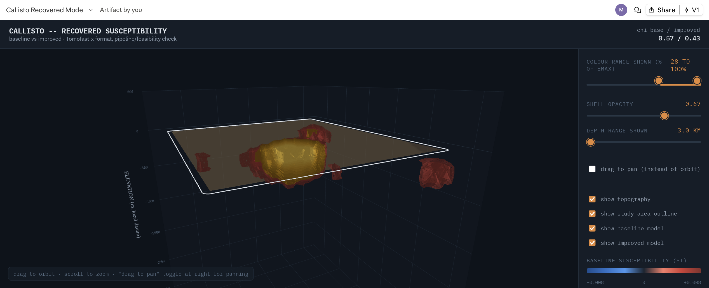
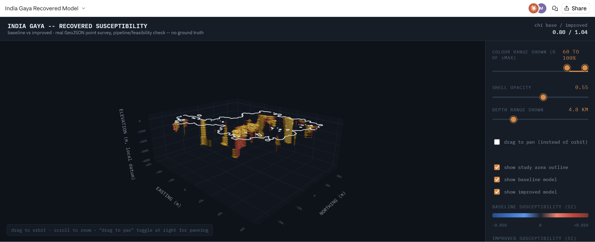
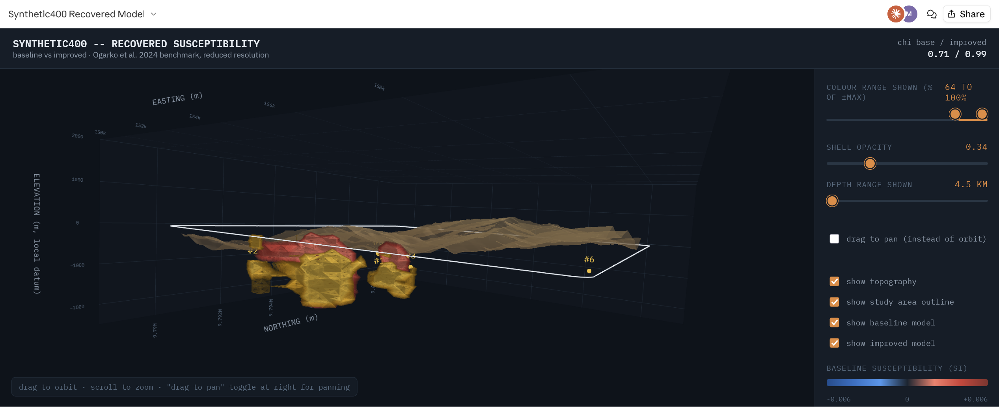
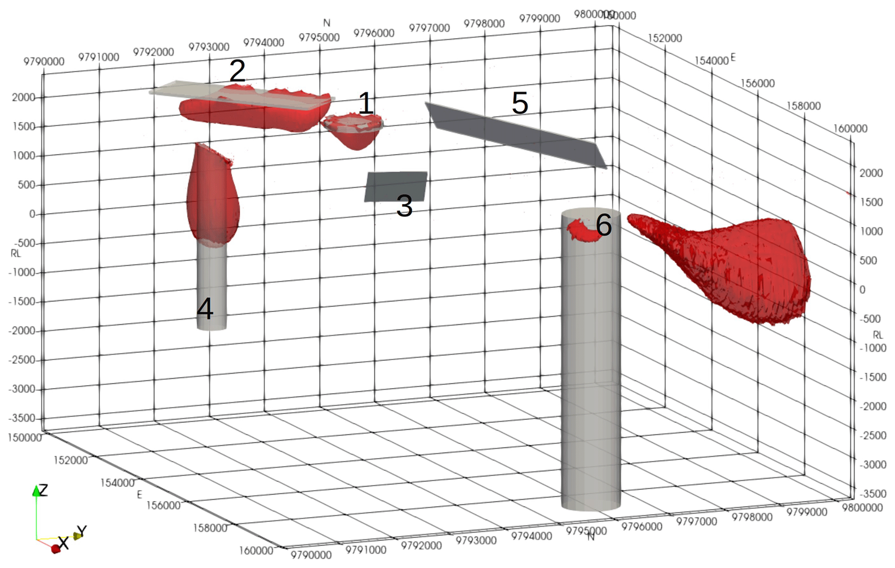
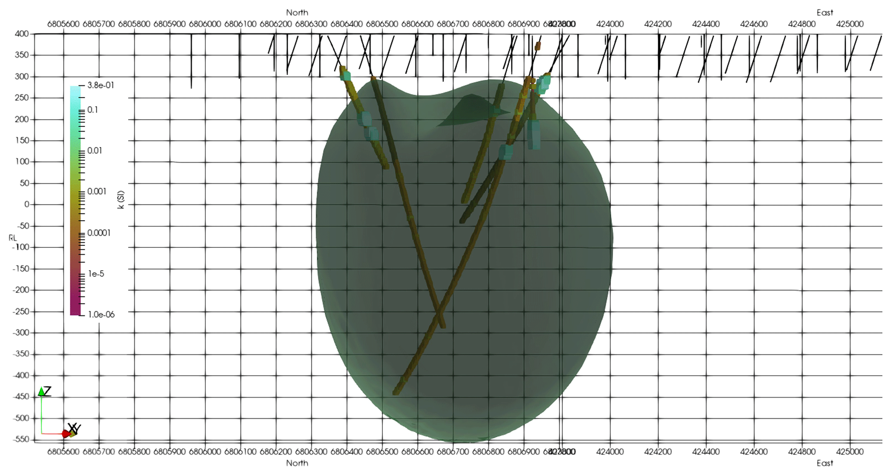

# Potential-field inversion pipeline

Runs a full 3D magnetic susceptibility inversion end to end: load
survey data in any of three supported formats, auto-calibrate the mesh
to your machine's RAM, invert (a flat-topography baseline pass, then a
real-topography + sparse/IRLS improved pass where topography data
exists), draw the study-area outline, generate 2D section figures, and
build an interactive 3D model viewer. **Point it at your own data folder
and it runs** -- format is auto-detected, no per-dataset setup required
(see "Quickstart").

Three input formats, auto-detected from what's actually in the data
folder (see "Supported input formats" below):

| Format | What it looks like | Where this pipeline's readers came from |
|---|---|---|
| `obs` | `*.OBS` + `TOMOPARAMS*.TXT` + `meshgrid*.txt` (plain text) | Tomofast-x 2.0's own format (Ogarko et al. 2024) |
| `raster` | `*.tif`/`*.tiff`/`*.ers` (a geographic grid) | grav_mag_inversion's own WA pipeline |
| `geojson` | `*.geojson` (point stations) | india_grav_mt_inversion's own pipeline |

Validated end to end on real data in all three: Tomofast-x's own two
published benchmarks (below), a real WA airborne magnetic raster
(chi=0.78), and a real India ground-station magnetic GeoJSON survey
(chi=0.80).

## One pipeline, three magnetic-data formats

The same workflow accepts Tomofast-x `OBS`, GeoTIFF/ERS raster, and
GeoJSON point-station surveys. The 3D outputs below show that the input
format changes at the reader boundary, while mesh construction,
calibration, inversion, and visualization remain shared.

| Tomofast-x `OBS` | GeoTIFF/ERS raster | GeoJSON point stations |
|---|---|---|
|  |  |  |
| Callisto benchmark: baseline and improved susceptibility models | WA Yilgarn airborne magnetic raster, detected and inverted directly | India Gaya ground-station magnetic survey, loaded from point features |

The rendered viewers include the survey outline and, where available,
topography, together with toggleable baseline and improved models. The
reported data-fit values for these examples are Callisto `0.57 -> 0.43`,
WA Yilgarn `0.78 -> 0.98`, and India Gaya `0.80 -> 1.04` (baseline to
improved chi; the two real surveys have no published ground truth).

## Comparison with the original Tomofast-x results

For the published benchmarks, the recovered structures are compared
visually with the original author's models below. The Synthetic400
benchmark is especially useful because it has six known bodies and a
published target chi of 1.0. At the calibrated, reduced resolution used
here, the improved run reaches chi `0.99`, while preserving the overall
body layout seen in the original result.

| Synthetic400: this pipeline | Synthetic400: original result |
|---|---|
|  |  |

The Callisto result is a real airborne survey with no published
subsurface ground truth. Its recovered susceptibility distribution is
shown alongside the original model as a method and structure comparison;
the two views are qualitatively consistent at the available resolution.

| Callisto: this pipeline | Callisto: original result |
|---|---|
|  |  |

These comparisons are intended as visual validation, not a claim that
the real-data inversions recover a unique geological truth. Full
benchmark metrics, runtime, memory use, and the known Synthetic400
artifact analysis are documented in `baseline_report.md` and
`improved_report.md`.

Two published Tomofast-x benchmarks (Ogarko et al. 2024, *Tomofast-x 2.0:
an open-source parallel code for inversion of potential field data with
topography using wavelet compression*, Geosci. Model Dev. 17, 2325-2345,
[doi:10.5194/gmd-17-2325-2024](https://doi.org/10.5194/gmd-17-2325-2024),
data at Zenodo [10.5281/zenodo.8397794](https://doi.org/10.5281/zenodo.8397794))
ship as worked examples with pre-calibrated settings and full validation
reports -- see "Included example datasets" below.

## What it does

```
input folder (.OBS+TOMOPARAMS+meshgrid, or .tif/.ers, or .geojson)
        |
        v
[1] detect + load + calibrate   src/discover.py, src/load_survey.py, src/auto_calibrate.py
    . detect which of the 3 formats the folder holds, find its file(s)
    . read it into a common (x, y, z, value, inducing-field) shape --
      obs: exact field from TOMOPARAMS; raster/geojson: IGRF-14 model
      (vendor.grav_mag_inversion.igrf), or real per-station field data
      if the geojson carries it
    . build an octree mesh; for a brand new dataset, auto-search
      decimation/cell-size combinations until the dense sensitivity
      matrix fits a RAM budget (measured directly, not estimated) --
      cached afterwards so this only runs once per dataset
    . remove a 2nd-degree regional trend; assign per-station noise
        |
        v
[2] invert (two passes)   scripts/run_baseline.py, scripts/run_improved.py
    baseline: flat topography, smooth L2 (WeightedLeastSquares)
    improved: sparse/IRLS regularization, sensitivity-kernel disk cache,
              PLUS real topography (DEM draped from receiver elevations)
              where the format has one -- "obs" only, see "Supported
              input formats"; raster/geojson stay flat for this pass too
        |
        +--> [3] 2D figures        scripts/plot_figures.py -> figures/
        |    study-area outline (real survey footprint, not just a
        |    bounding box), data fit, convergence, E-W/N-S model sections
        |
        +--> [4] 3D viewer         scripts/build_viewer.py -> viewer/
        |    interactive susceptibility isosurfaces (baseline + improved,
        |    toggleable), real topography surface, survey outline
        |
        +--> [5] upload (optional)   scripts/upload_to_s3.py
             sync results/figures/viewer to an S3 bucket you already
             have `aws` configured for
```

Every stage also runs standalone (see "How to run it"); `scripts/
run_pipeline.py` just chains [1]-[4] (and optionally [5]) in one command.

Built on top of `vendor/grav_mag_inversion/` (SimPEG-based mesh/forward/
inversion/plotting code, vendored from a sibling project -- see its own
`VENDORED.md`) -- none of that code is modified here, only called.

## Quickstart

```bash
cd "WEST AUS/Tomofastx2.0_models"
pip install -r requirements.txt

# a dataset this repo ships pre-calibrated settings for (see below):
python -m scripts.run_pipeline --benchmark callisto

# ANY other dataset in any of the 3 supported formats -- auto-detected,
# mesh/decimation auto-calibrated against your machine's RAM the first
# time (cached after). A raster needs an AOI if it's a LARGE statewide
# grid (see "Supported input formats"); a geojson needs TOMOFASTX_VALUE_
# KEY (which property is the data):
python -m scripts.run_pipeline --data-dir /path/to/your/survey --ram-budget-gb 8
TOMOFASTX_VALUE_KEY=magnetic_a python -m scripts.run_pipeline --data-dir /path/to/stations
```

That's the whole thing for a first run. Output:

```
results/<name>_result.npz            baseline inversion result
results/<name>_improved_result.npz   improved inversion result
figures/<name>_*.png                 study area, data fit, convergence, model sections
viewer/model3d_<name>.html           interactive 3D model (open in a browser)
```

(`<name>` = the benchmark name, or your data folder's own basename for
`--data-dir`, or `--name` to override it.)

## Supported input formats

The format is auto-detected from what's in the folder (src/discover.py)
-- obs takes priority if a folder somehow has more than one format's
marker file, then raster, then geojson. Full details (readers, exact
field names, what's reused vs. rebuilt) are in `src/load_survey.py`'s
module docstring; this table is the quick reference.

| | `obs` | `raster` | `geojson` |
|---|---|---|---|
| Detected by | `*.OBS` file | `*.tif`/`*.tiff`/`*.ers` file | `*.geojson` file |
| Also needs | `*TOMOPARAMS*.TXT`, `meshgrid*.txt` (auto-found alongside) | nothing required; `TOMOFASTX_AOI` if windowing into a LARGER raster than your survey | `TOMOFASTX_VALUE_KEY` (**required** -- which feature property is the data, e.g. `magnetic_a`) |
| Inducing field | Exact, from TOMOPARAMS | IGRF-14 model at the data's centroid (`TOMOFASTX_IGRF_DATE`) | Real per-station data if you pass `TOMOFASTX_IGRF_AMPLITUDE_KEY` (e.g. `igrf_nt`), else IGRF-14 model |
| Receiver elevation | Real -- the only format with topography draping | None -- flat z=0 (matches WA's own pipeline) | None by default -- flat z=0 (matches India's own pipeline; `TOMOFASTX_ELEVATION_KEY` is read but not yet wired to receiver z) |
| Decimation | Regular-raster stride subsampling | Regular-raster stride subsampling | None -- already-sparse points, used as-is |
| Unit conversion | N/A (nT already) | `TOMOFASTX_VALUE_SCALE` (e.g. WA's own gravity grids need 10.0, micro-m/s^2 -> mGal) | N/A (assumed already in the target unit) |
| Where the readers came from | Tomofast-x 2.0 (Ogarko et al. 2024) | grav_mag_inversion's own WA pipeline (`vendor/.../io_raster.py`) | india_grav_mt_inversion's own pipeline (`vendor/.../io_geojson.py`) |

All three converge on the same shared pipeline after loading (mesh
build, regional trend removal, SimPEG assembly, inversion) -- see "What
it does" above.

Currently magnetic (TMI) data only for the inversion stage itself --
`raster`'s reader can load a gravity grid too (`TOMOFASTX_FIELD=gravity`,
matching WA's own `load_gravity_window`), but nothing downstream has
been run against gravity data yet (see "Known limitations").

Every `TOMOFASTX_*` override above (and the general ones -- name, RAM
budget, mesh parameters, noise model, depth window) is documented in
`config/config.py`'s module docstring.

## How resolution is chosen

This pipeline's inversion method (`SimPEG.Simulation3DIntegral`) builds
a **dense** sensitivity matrix (n_receivers x n_active_cells x 8 bytes) --
no MPI, no wavelet compression (unlike Tomofast-x's own native method).
At a real survey's native resolution that matrix is usually far larger
than a normal machine's RAM (see "Included example datasets" below for
the actual numbers on both shipped benchmarks), so both the receiver grid
and the mesh are decimated/coarsened before inverting.

For the two shipped benchmarks this was done once, by hand, and the
result is recorded in `config/config.py`'s `BENCHMARKS` registry (exact
receiver counts, cell sizes, and the resulting matrix size, all measured
directly -- see that file's comments). For any other dataset (`--data-
dir`), `src/auto_calibrate.py` automates the same process, in one of two
modes depending on the format:

- **`obs`/`raster`** (a regular receiver grid, decimatable): try
  decimation strides from fine to coarse, build the **actual** candidate
  mesh at each one (not an estimate), measure the real active-cell count
  and resulting matrix size, stop at the finest stride that fits your
  `--ram-budget-gb` (default 4.0 GB).
- **`geojson`** (already-sparse points, no decimation axis): the
  receiver count is fixed, so instead search over `core_cell_m` itself,
  starting near the median nearest-neighbour station spacing (the same
  rule of thumb india_grav_mt_inversion's own config.py used by hand --
  checked directly against it: auto-calibrating a real India district
  independently landed on exactly its own hand-picked 650 m).

Each candidate mesh build runs in its own subprocess with a hard kill on
timeout (not a signal-based one -- confirmed directly that SIGALRM does
not reliably interrupt discretize's compiled mesh-construction code, so
only a real process kill is a reliable safety net against a pathological
candidate). The result is cached to `results/<name>_calibration.json` so
it only runs once per dataset. See `python -m scripts.run_pipeline
--help` and `config/config.py`'s module docstring for every `TOMOFASTX_*`
override (fixing one or more parameters by hand, a different RAM budget,
a different noise model, etc).

## Included example datasets

| | Synthetic400 | Callisto |
|---|---|---|
| Data | Fully synthetic, 6 known bodies, no real measurements | Real 1998 airborne magnetic survey |
| Ground truth | Table 3 susceptibilities + Fig. 4-digitised positions | **None published** -- no drill-hole data in the release |
| Native | 400x400 receivers, ~25 m spacing | 200x176 receivers, ~12-13 m spacing |
| Used (calibrated) | 4,489 receivers, 100 m cells -> 62,976/65,144 active cells | 3,953 receivers, 20 m cells -> 83,688/83,476 active cells |
| Dense matrix | ~1.9-2.0 GB | ~2.65 GB |
| Validated? | Yes -- full per-body report, see below | No -- pipeline/feasibility check only |

| | Baseline (flat, smooth L2) | Improved (topography, sparse/IRLS) |
|---|---:|---:|
| Synthetic400 chi (target 1.0) | 0.71 | 0.99 |
| Synthetic400 wall time / peak RSS | ~80 s / 2.3 GB | ~170 s / 2.4 GB |
| Callisto chi (target 1.0) | 0.57 | 0.43 |
| Callisto wall time / peak RSS | ~121 s / 2.9 GB | ~188 s / 2.8 GB |

**Read `baseline_report.md` and `improved_report.md` before treating
either result as more than a data-fit number.** Short version: every
Synthetic400 "improved" recovered body sits next to a larger, incorrectly-
signed structure -- an unresolved artifact investigated at length in
`improved_report.md`'s "Root cause investigation," not something this
pipeline currently corrects for. See "Known limitations" below.

Get the data (not shipped in this repo -- `.gitignore`'d, large
third-party files):
- [Zenodo 10.5281/zenodo.8397794](https://doi.org/10.5281/zenodo.8397794)
  -- extract `Tomofastx2.0_models.7z` so `synthetic400/` and `callisto/`
  sit at this project's root.
- [github.com/TOMOFAST/Tomofast-x](https://github.com/TOMOFAST/Tomofast-x)
  (optional -- only to cross-check methodology against the paper's own
  source; not needed to run anything here).

## How to run it

```bash
cd "WEST AUS/Tomofastx2.0_models"

# one command, either a shipped benchmark or your own data (format auto-detected):
python -m scripts.run_pipeline --benchmark synthetic400
python -m scripts.run_pipeline --benchmark callisto
python -m scripts.run_pipeline --data-dir /path/to/your/obs/survey
python -m scripts.run_pipeline --data-dir /path/to/your/raster --ram-budget-gb 8
TOMOFASTX_AOI="120.9,121.4,-31.1,-30.6" python -m scripts.run_pipeline --data-dir /path/to/big/raster
TOMOFASTX_VALUE_KEY=magnetic_a python -m scripts.run_pipeline --data-dir /path/to/your/geojson

# ...or run each stage by hand (same TOMOFASTX_BENCHMARK/TOMOFASTX_DATA_DIR
# env vars config.py reads -- see its module docstring for every override):
python -m scripts.run_baseline             # baseline
python -m scripts.run_improved             # improved (first run computes+caches
                                           # the sensitivity kernel; reused on rerun)
python -m scripts.plot_figures             # 2D figures for both results
python -m scripts.build_viewer             # 3D viewer
python -m scripts.build_improved_report    # Synthetic400 only -- regenerates
                                           # improved_report.md's per-body validation
python -m scripts.sweep_beta               # optional -- kernel-cache speedup demo, ~10 min

# optional, after any of the above:
python -m scripts.upload_to_s3 --bucket my-bucket [--dry-run]
```

`TOMOFASTX_BENCHMARK=callisto python -m scripts.run_baseline` (env var)
and `python -m scripts.run_pipeline --benchmark callisto` (CLI flag) are
equivalent -- `run_pipeline.py` just sets the env var for you before
calling each stage.

## Layout

```
config/config.py             dataset/format selection + all mesh/resolution/noise
                              parameters -- see its own module docstring for the
                              full TOMOFASTX_* reference
src/discover.py               auto-detects which of the 3 formats a folder holds
                              and its input file(s)
src/auto_calibrate.py         auto-calibrates mesh/decimation against a RAM budget
                              (two modes -- decimatable grid vs. fixed sparse points)
src/load_survey.py            per-format readers (obs/raster/geojson) + the shared
                              pipeline every format converges on afterwards
                              (topography draping, mesh build, SimPEG assembly)
src/topography.py             DEM interpolation + active-cell draping ("obs" only)
src/distance_weighting.py     an alternative sensitivity-weighting scheme (built,
                              tested, not what the shipped "improved" runs use --
                              see its own module docstring for why)
src/kernel_cache.py           hash-keyed disk cache for the sensitivity matrix
src/artefact_detector.py      flags known smooth-L2 inversion artefacts, with evidence
src/validation.py             per-body recovery metrics -- Synthetic400 only (needs
                              its published ground truth; no generic equivalent exists)
src/coverage.py               real survey-footprint outline (distance-to-nearest-
                              receiver thresholding, not a bounding box)
src/invert_v2.py              inversion runners this project adds (sparse/IRLS with
                              caching, a positivity-bound experiment, a positivity-
                              reparameterisation experiment) -- see its own module
                              docstring for which is used by default and why
scripts/run_baseline.py            baseline driver (flat topography, smooth L2)
scripts/run_improved.py            improved driver (real topography, sparse/IRLS)
scripts/plot_figures.py            2D figures for whichever dataset is selected
scripts/build_viewer.py            3D viewer
scripts/upload_to_s3.py            optional S3 sync of results/figures/viewer
scripts/run_pipeline.py            one-command orchestrator (stages [1]-[4], optionally [5])
scripts/sweep_beta.py              kernel-cache speedup demo
scripts/build_improved_report.py   regenerates improved_report.md (Synthetic400 only)
vendor/grav_mag_inversion/         vendored SimPEG mesh/forward/inversion/plotting
                                   code, plus the WA/India projects' own raster/
                                   geojson readers and IGRF-14 lookup -- this
                                   pipeline calls all of it but doesn't modify any
                                   of it -- see its own VENDORED.md for provenance
docs/screenshots/                  README figures showing all three input formats
                                   and comparisons with the original results
results/, figures/, viewer/        generated outputs, one file set per dataset name
                                   (nothing here is hand-edited -- rerun the scripts
                                   above after any code/parameter change)
results/experiments/               one-off diagnostic runs cited in improved_report.
                                   md's "Root cause investigation" -- not part of
                                   the regular pipeline
baseline_report.md                 Synthetic400 validation report, round 1
improved_report.md                 Synthetic400 validation report, round 2/3,
                                   including the sign-flip artifact investigation
```

## Known limitations

1. **No MPI/HPC or wavelet compression yet** -- the current inversion
  builds a dense sensitivity matrix in one process, so the matrix size
  and resolution are capped by one machine's RAM. Synthetic400 therefore
  runs at 4,489 receivers and 62,976 active cells rather than its native
  160,000 receivers and 5,420,800 cells. Connecting the forward and
  inversion stages to MPI/HPC, or adding a validated distributed/tiled
  operator, is the main route toward paper-scale resolution.
2. **Physical susceptibility bounds are still being developed** -- the
  default sparse/IRLS run does not enforce a non-negative susceptibility.
  Bound-constrained (`ProjectedGNCG`) and reparameterisation approaches
  have been tested but are not yet stable enough for the default
  workflow. On Synthetic400, the improved run reaches chi `0.99`
  compared with `0.71` for baseline, but every recovered body still has
  a larger nearby opposite-sign structure; see `improved_report.md`'s
  "Root cause investigation".
3. **Validation is incomplete for real data** -- Callisto has no
  published drill-hole or body-location ground truth in the released
  files, so its comparison with the original result is qualitative.
  Synthetic400 also lacks numeric depth and reliable volume ground truth;
  several body positions are digitised from a figure with roughly
  300--500 m uncertainty.
4. **The supported inversion scope is limited** -- the implemented
  inversion targets induced magnetic susceptibility. Remanent/vector
  magnetisation and a downstream gravity inversion have not yet been
  exercised. Raster and GeoJSON inputs also use flat receivers because
  real per-station topography is not currently available in those paths.
5. **Some inputs use starting assumptions** -- auto-calibration selects
  resolution heuristically, and noise is estimated when per-station
  uncertainties are absent. These are useful defaults for a first run,
  not substitutes for dataset-specific tuning and validation.

See `improved_report.md`'s "Root cause investigation" for the full,
numbered trail behind #3 (every configuration tried, side by side) --
this section is a summary, not a substitute for it.
